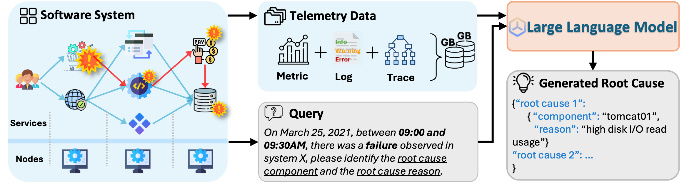
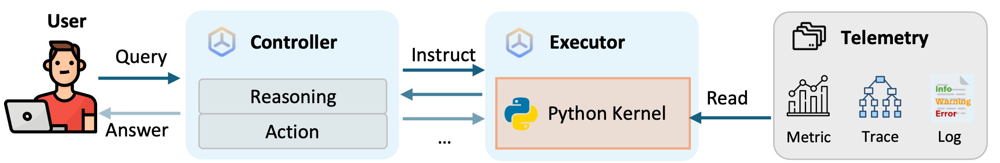

# OpenRCA

&ensp;
[](https://opensource.org/licenses/MIT)&ensp;


</div>

OpenRCA is a benchmark for assessing LLMs' root cause analysis ability in a software operating scenario. When given a natural language query, LLMs need to analyze large volumes of telemetry data to identify the relevant root cause elements. This process requires the models to understand complex system dependencies and perform comprehensive reasoning across various types of telemetry data, including KPI time series, dependency trace graphs, and semi-structured log text.

 

</div>

We also introduce RCA-agent as a baseline for OpenRCA. By using Python for data retrieval and analysis, the model avoids processing overly long contexts, enabling it to focus on reasoning and scalable for extensive telemetry.

 

## ✨ Quick Start

> ⚠️ Since the OpenRCA dataset includes a large amount of telemetry and RCA-agent requires extensive memory operations, we recommend using a device with at least 80GB of storage space and 32GB of memory.

### 🛠️ Installation

OpenRCA requires **Python >= 3.10**. It can be installed by running the following command:
```bash
# [optional to create conda environment]
# conda create -n openrca python=3.10
# conda activate openrca

# clone the repository
git clone https://github.com/microsoft/OpenRCA.git
cd OpenRCA
# install the requirements
pip install -r requirements.txt
```

The telemetry data can be download from [Google Drive](https://drive.google.com/drive/folders/1wGiEnu4OkWrjPxfx5ZTROnU37-5UDoPM?usp=drive_link). Once you have download the telemetry dataset, please put them into the path `dataset/` (which is empty now).

The directory structure of the data is:

```
.
├── {SYSTEM}
│   ├── query.csv
│   ├── record.csv
│   └── telemetry
│       ├── {DATE}
│       │   ├── log
│       │   ├── metric
│       │   └── trace
│       └── ... 
└── ...
```

where the `{SYSTEM}` can be `Telecom`, `Bank`, or `Market`, and the `{DATE}` format is `{YYYY_MM_DD}`.

### 🖊️ Evaluation

Using following command to evaluate:

```bash
python -m main.evaluate \
    -p [prediction csv files to evaluate] \
    -q [groundtruth csv files to evaluate] \
    -r [report csv file to save]
```

Note that the prediction CSV file must include at least a "prediction" field for valid evaluation (extra fields are allowed). Each prediction should be a JSON-like string containing all required elements for each query (extra elements are allowed). If there are multiple failures, list them in chronological order (e.g., 1, 2, 3, ...):


```json
{
    "1": {
        "root cause occurrence datetime": "[%Y-%m-%d %H:%M:%S]",
        "root cause component": "[COMPONENT]",
        "root cause reason": "[REASON]"
    }, 
    ...
}
```

For example, to evaluate the archived predictions of RCA-agent (Claude ver.), you can use the following command:

```bash
python -m main.evaluate \
    -p \
        rca/archive/agent-Bank.csv \
        rca/archive/agent-Market-cloudbed-1.csv \
        rca/archive/agent-Market-cloudbed-2.csv \
        rca/archive/agent-Telecom.csv \
    -q \
        dataset/Bank/query.csv \
        dataset/Market/cloudbed-1/query.csv \
        dataset/Market/cloudbed-2/query.csv \
        dataset/Telecom/query.csv \
    -r \
        test/agent_claude.csv
```

### 🚩 Reproduction

To reproduce results in the paper, please first setup your API configurations before running OpenRCA's baselines. Taking OpenAI as an example, you can configure `rca/api_config.yaml` file as follows:

```yaml
SOURCE:   "OpenAI"
MODEL:    "gpt-4o-2024-05-13"
API_KEY:  "sk-xxxxxxxxxxxxxx"
```

Then, run the following commands for result reproduction:

```bash
python -m rca.{TESTS} --dataset {DATASET_NAME}
# Optional tests: run_agent_standard, run_baseline_balanced, run_baseline_oracle
# Optional datasets: Telecom, Bank, Market/cloudbed-1, Market/cloudbed-2
```

For example, if you want to evaluate RCA-agent on Bank dataset, you should use the following command:

```bash
python -m rca.run_agent_standard --dataset Bank
```

Note that the telemetry of two Market cloudbed service group are collected separately. For example, if you want to evaluate RCA-agent on the whole Market dataset, you should use the following command:

```bash
python -m rca.run_agent_standard --dataset Market/cloudbed-1
python -m rca.run_agent_standard --dataset Market/cloudbed-2
```

The generated results and monitor files can be found in a new `test` directory created after running any test script.

### 💽 Reconstruction

You can generate new task for OpenRCA telemetry or your own privacy telemetry by modifying `main/task_specification.json` and run the following command:

```bash
python -m main.generate \
    -s [your specification config file] \
    -r [record file to generate query] \
    -q [query file to save] \
    -t [timezone of telemetry]
```

Note that the record schema should be consistent with the `record.csv` of OpenRCA.

You can also re-generate random queries of OpenRCA with the following command:

```bash
python -m main.generate -d True
```

## 📚 Citation

If you use OpenRCA in your research, please cite our paper:

```bibtex
@inproceedings{
xu2025openrca,
title={OpenRCA: Can Large Language Models Locate the Root Cause of Software Failures?},
author={Xu, Junjielong and Zhang, Qinan and Zhong, Zhiqing and He, Shilin and Zhang, Chaoyun and Lin, Qingwei and Pei, Dan and He, Pinjia and Zhang, Dongmei and Zhang, Qi},
booktitle={The Thirteenth International Conference on Learning Representations},
year={2025},
url={https://openreview.net/forum?id=M4qNIzQYpd}
}
```

## Trademarks

This project may contain trademarks or logos for projects, products, or services. Authorized use of Microsoft 
trademarks or logos is subject to and must follow 
[Microsoft's Trademark & Brand Guidelines](https://www.microsoft.com/en-us/legal/intellectualproperty/trademarks/usage/general).
Use of Microsoft trademarks or logos in modified versions of this project must not cause confusion or imply Microsoft sponsorship.
Any use of third-party trademarks or logos are subject to those third-party's policies.

## Disclaimer
The recommended models in this Repo are just examples, used to explore the potential of agent systems with the paper at ICLR2025. Users can replace the models in this Repo according to their needs. When using the recommended models in this Repo, you need to comply with the licenses of these models respectively. Microsoft shall not be held liable for any infringement of third-party rights resulting from your usage of this repo. Users agree to defend, indemnify and hold Microsoft harmless from and against all damages, costs, and attorneys' fees in connection with any claims arising from this Repo. If anyone believes that this Repo infringes on your rights, please notify the project owner email.
